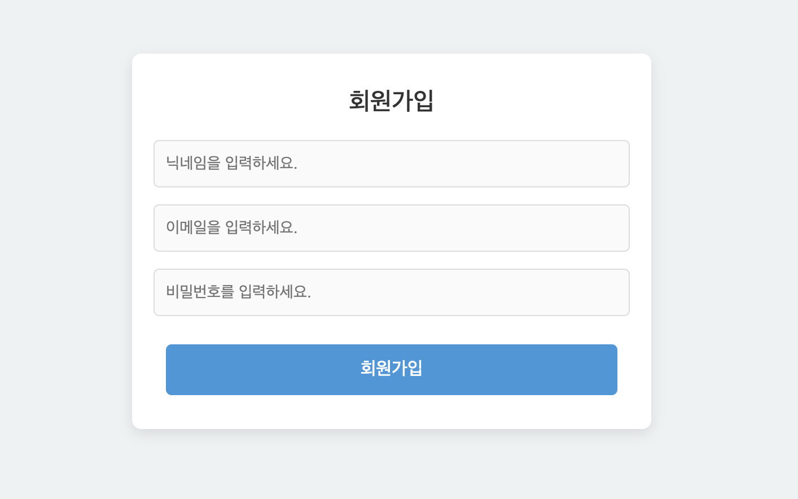
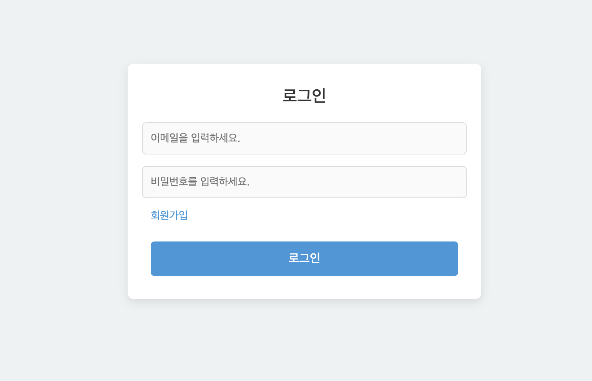
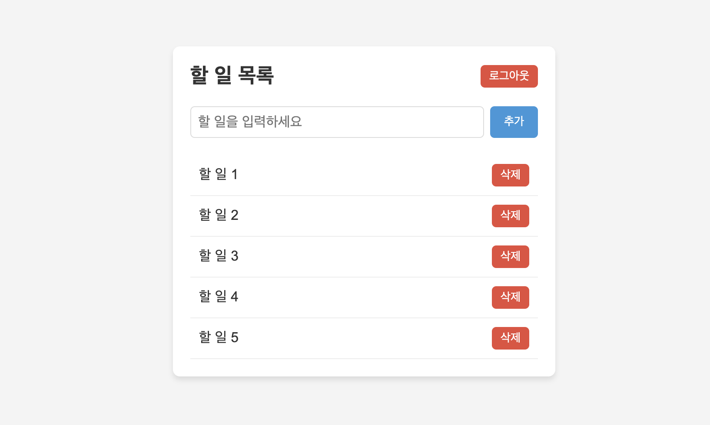

# todo-frontend

## 프로젝트 소개
- 플랫폼: Web
- 사용 기술: Vue.js, PostgreSQL, Spring boot

'todo list'는 기초적인 할 일 관리 웹입니다.

**미리보기**

회원가입 페이지

로그인 페이지

메인 페이지

## 구현 기능
- 회원가입
- 로그인
- 할일 관리
  - 할일 추가
  - 할일 완료
  - 할일 삭제
